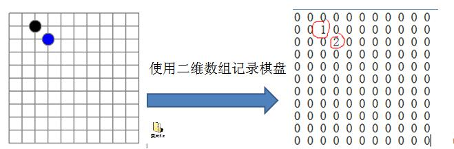
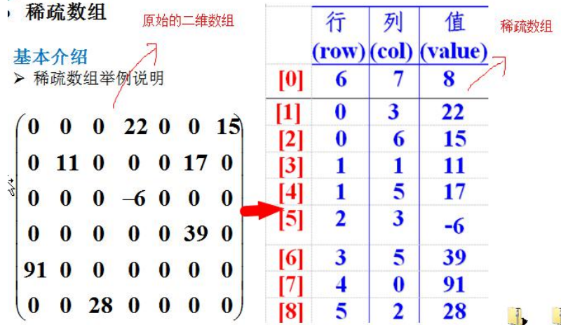
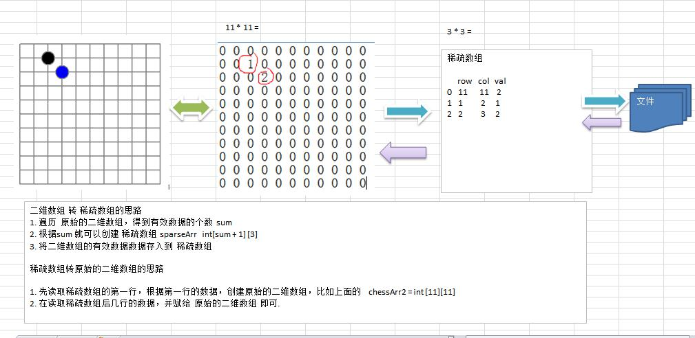
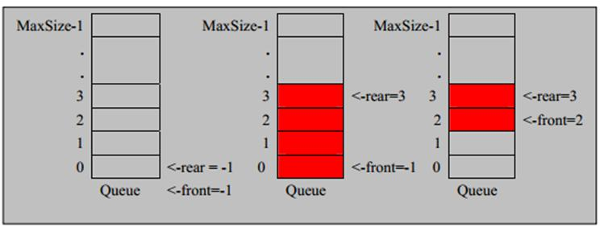
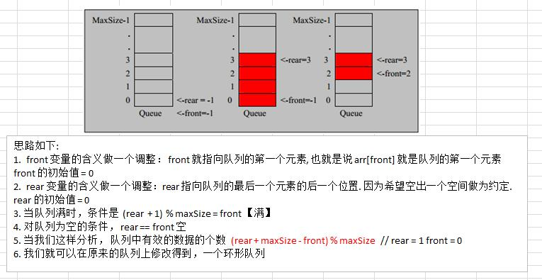

# 学习算法与数据结构
## 第一章 稀疏数组
### 先看一个实际的需求
编写的五子棋程序中，有存盘退出和续上盘的功能。

* 分析问题：因为该数组的很多值是默认值0，因此记录了很多没有意义的数据->稀疏数组
### 基本介绍
当一个数组中大部分元素为0，或者同一个值的数组时，可以使用稀疏数组来保存该数组。<br/>
稀疏数组的处理方法是：<br/>
* 记录数一共有有几行几列，有多少不同的值
* 把具有不同值的元素的行列机值记录在一个小规模的数组中，从而缩小程序的规模<br/>

  
### 应用实例
1) 使用稀疏数组，来保留类似前面的二维数组(棋盘、地图等等) 
2) 把稀疏数组存盘，并且可以从新恢复原来的二维数组数 
3) 整体思路分析

   
4）代码实现
```java
package sparsearray;

public class SparseArray {

    public static void main(String[] args) {
        // 创建一个原始的二维数组 11 * 11
        // 0: 表示没有棋子， 1 表示 黑子 2 表蓝子
        int [][]chessArr1 = new int[11][11];
        chessArr1[1][2] = 1;
        chessArr1[2][3] = 2;
        chessArr1[4][5] = 2;
        // 输出原始的二维数组
        System.out.println("原始的二维数组~~");
        for (int[] row : chessArr1) {
            for (int data : row) {
                System.out.printf("%d\t", data);
            }
            System.out.println();
        }

        // 将二维数组 转 稀疏数组的思
        // 1. 先遍历二维数组 得到非0数据的个数
        int sum = 0;
        for (int i = 0; i < 11; i++) {
            for (int j = 0; j < 11; j++) {
                if (chessArr1[i][j] != 0) {
                    sum++;
                }
            }
        }

        // 2. 创建对应的稀疏数组
        int [][] sparseArr= new int[sum + 1][3];
        // 给稀疏数组赋值
        sparseArr[0][0] = 11;
        sparseArr[0][1] = 11;
        sparseArr[0][2] = sum;

        // 遍历二维数组，将非0的值存放到 sparseArr中
        int count = 0; //count 用于记录是第几个非0数据
        for (int i = 0; i < 11; i++) {
            for (int j = 0; j < 11; j++) {
                if (chessArr1[i][j] != 0) {
                    count++;
                    sparseArr[count][0] = i;
                    sparseArr[count][1] = j;
                    sparseArr[count][2] = chessArr1[i][j];
                }
            }
        }

        // 输出稀疏数组的形式
        System.out.println();
        System.out.println("得到稀疏数组为~~~~");
        for (int[] ints : sparseArr) {
            System.out.printf("%d\t%d\t%d\t\n", ints[0], ints[1], ints[2]);
        }
        System.out.println();

        //将稀疏数组 --》 恢复成 原始的二维数组
		/*
		 *  1. 先读取稀疏数组的第一行，根据第一行的数据，创建原始的二维数组，比如上面的  chessArr2 = int [11][11]
			2. 在读取稀疏数组后几行的数据，并赋给 原始的二维数组 即可.
		 */

        //1. 先读取稀疏数组的第一行，根据第一行的数据，创建原始的二维数组

        int [][] chessArr2= new int[sparseArr[0][0]][sparseArr[0][1]];

        //2. 在读取稀疏数组后几行的数据(从第二行开始)，并赋给 原始的二维数组 即可

        for(int i = 1; i < sparseArr.length; i++) {
            chessArr2[sparseArr[i][0]][sparseArr[i][1]] = sparseArr[i][2];
        }

        // 输出恢复后的二维数组
        System.out.println();
        System.out.println("恢复后的二维数组");

        for (int[] row : chessArr2) {
            for (int data : row) {
                System.out.printf("%d\t", data);
            }
            System.out.println();
        }
    }

}
```
## 第二章 队列
### 队列介绍
1) 队列是一个有序列表，可以用数组或是链表来实现。 
2) 遵循先入先出的原则。即：先存入队列的数据，要先取出。后存入的要后取出 
3) 示意图：(使用数组模拟队列示意图)

   
### 数组模拟队列思路
1) 队列本身是有序列表，若使用数组的结构来存储队列的数据，则队列数组的声明如下图, 其中 maxSize 是该队 列的最大容量。 
2) 因为队列的输出、输入是分别从前后端来处理，因此需要两个变量 front 及 rear 分别记录队列前后端的下标， 
   front 会随着数据输出而改变，而 rear 则是随着数据输入而改变，如图所示:
   

1) 当我们将数据存入队列时称为”addQueue”，addQueue 的处理需要有两个步骤：思路分析 1) 将尾指针往后移：rear+1 , 当 front == rear 【空】 
2) 若尾指针 rear 小于队列的最大下标 maxSize-1，则将数据存入 rear 所指的数组元素中，否则无法存入数据。 rear == maxSize - 1[队列满]
```java
package queue;

import java.util.Scanner;

public class ArrayQueueDemo {

    public static void main(String[] args) {
        //测试一把
        //创建一个队列
        ArrayQueue queue = new ArrayQueue(3);
        char key = ' '; //接收用户输入
        Scanner scanner = new Scanner(System.in);//
        boolean loop = true;
        //输出一个菜单
        while(loop) {
            System.out.println("s(show): 显示队列");
            System.out.println("e(exit): 退出程序");
            System.out.println("a(add): 添加数据到队列");
            System.out.println("g(get): 从队列取出数据");
            System.out.println("h(head): 查看队列头的数据");
            key = scanner.next().charAt(0);//接收一个字符
            switch (key) {
                case 's':
                    queue.showQueue();
                    break;
                case 'a':
                    System.out.println("输出一个数");
                    int value = scanner.nextInt();
                    queue.addQueue(value);
                    break;
                case 'g': //取出数据
                    try {
                        int res = queue.getQueue();
                        System.out.printf("取出的数据是%d\n", res);
                    } catch (Exception e) {
                        // TODO: handle exception
                        System.out.println(e.getMessage());
                    }
                    break;
                case 'h': //查看队列头的数据
                    try {
                        int res = queue.headQueue();
                        System.out.printf("队列头的数据是%d\n", res);
                    } catch (Exception e) {
                        // TODO: handle exception
                        System.out.println(e.getMessage());
                    }
                    break;
                case 'e': //退出
                    scanner.close();
                    loop = false;
                    break;
                default:
                    break;
            }
        }

        System.out.println("程序退出~~");
    }

}

// 使用数组模拟队列-编写一个ArrayQueue类
class ArrayQueue {
    private int maxSize; // 表示数组的最大容量
    private int front; // 队列头
    private int rear; // 队列尾
    private int[] arr; // 该数据用于存放数据, 模拟队列

    // 创建队列的构造器
    public ArrayQueue(int arrMaxSize) {
        maxSize = arrMaxSize;
        arr = new int[maxSize];
        front = -1; // 指向队列头部，分析出front是指向队列头的前一个位置.
        rear = -1; // 指向队列尾，指向队列尾的数据(即就是队列最后一个数据)
    }

    // 判断队列是否满
    public boolean isFull() {
        return rear == maxSize - 1;
    }

    // 判断队列是否为空
    public boolean isEmpty() {
        return rear == front;
    }

    // 添加数据到队列
    public void addQueue(int n) {
        // 判断队列是否满
        if (isFull()) {
            System.out.println("队列满，不能加入数据~");
            return;
        }
        rear++; // 让rear 后移
        arr[rear] = n;
    }

    // 获取队列的数据, 出队列
    public int getQueue() {
        // 判断队列是否空
        if (isEmpty()) {
            // 通过抛出异常
            throw new RuntimeException("队列空，不能取数据");
        }
        front++; // front后移
        return arr[front];

    }

    // 显示队列的所有数据
    public void showQueue() {
        // 遍历
        if (isEmpty()) {
            System.out.println("队列空的，没有数据~~");
            return;
        }
        for (int i = 0; i < arr.length; i++) {
            System.out.printf("arr[%d]=%d\n", i, arr[i]);
        }
    }

    // 显示队列的头数据， 注意不是取出数据
    public int headQueue() {
        // 判断
        if (isEmpty()) {
            throw new RuntimeException("队列空的，没有数据~~");
        }
        return arr[front + 1];
    }
}
```
* 问题分析并优化
1) 目前数组使用一次就不能用了，没有达到复用的效果
2) 将这个数组使用算法，该进程一个环形队列，取模：%

### 数组模拟环形队列
* 对前面的数组模拟队列的优化，充分利用数组. 因此将数组看做是一个环形的。(通过取模的方式来实现即可)
* 分析说明：
1) 尾索引的下一个为头索引时表示队列满，即将队列容量空出一个作为约定,这个在做判断队列满的 时候需要注意 (rear + 1) % maxSize == front 满]
2) rear == front [空]
3) 分析示意图:

   
* 代码实现
```java
package queue;

import java.util.Scanner;

public class CircleArrayQueueDemo {

    public static void main(String[] args) {

        //测试一把
        System.out.println("测试数组模拟环形队列的案例~~~");

        // 创建一个环形队列
        CircleArray queue = new CircleArray(4); //说明设置4, 其队列的有效数据最大是3
        char key = ' '; // 接收用户输入
        Scanner scanner = new Scanner(System.in);//
        boolean loop = true;
        // 输出一个菜单
        while (loop) {
            System.out.println("s(show): 显示队列");
            System.out.println("e(exit): 退出程序");
            System.out.println("a(add): 添加数据到队列");
            System.out.println("g(get): 从队列取出数据");
            System.out.println("h(head): 查看队列头的数据");
            key = scanner.next().charAt(0);// 接收一个字符
            switch (key) {
                case 's':
                    queue.showQueue();
                    break;
                case 'a':
                    System.out.println("输出一个数");
                    int value = scanner.nextInt();
                    queue.addQueue(value);
                    break;
                case 'g': // 取出数据
                    try {
                        int res = queue.getQueue();
                        System.out.printf("取出的数据是%d\n", res);
                    } catch (Exception e) {
                        // TODO: handle exception
                        System.out.println(e.getMessage());
                    }
                    break;
                case 'h': // 查看队列头的数据
                    try {
                        int res = queue.headQueue();
                        System.out.printf("队列头的数据是%d\n", res);
                    } catch (Exception e) {
                        // TODO: handle exception
                        System.out.println(e.getMessage());
                    }
                    break;
                case 'e': // 退出
                    scanner.close();
                    loop = false;
                    break;
                default:
                    break;
            }
        }
        System.out.println("程序退出~~");
    }

}


class CircleArray {
    private int maxSize; // 表示数组的最大容量
    //front 变量的含义做一个调整： front 就指向队列的第一个元素, 也就是说 arr[front] 就是队列的第一个元素
    //front 的初始值 = 0
    private int front;
    //rear 变量的含义做一个调整：rear 指向队列的最后一个元素的后一个位置. 因为希望空出一个空间做为约定.
    //rear 的初始值 = 0
    private int rear; // 队列尾
    private int[] arr; // 该数据用于存放数据, 模拟队列

    public CircleArray(int arrMaxSize) {
        maxSize = arrMaxSize;
        arr = new int[maxSize];
    }

    // 判断队列是否满
    public boolean isFull() {
        return (rear  + 1) % maxSize == front;
    }

    // 判断队列是否为空
    public boolean isEmpty() {
        return rear == front;
    }

    // 添加数据到队列
    public void addQueue(int n) {
        // 判断队列是否满
        if (isFull()) {
            System.out.println("队列满，不能加入数据~");
            return;
        }
        //直接将数据加入
        arr[rear] = n;
        //将 rear 后移, 这里必须考虑取模
        rear = (rear + 1) % maxSize;
    }

    // 获取队列的数据, 出队列
    public int getQueue() {
        // 判断队列是否空
        if (isEmpty()) {
            // 通过抛出异常
            throw new RuntimeException("队列空，不能取数据");
        }
        // 这里需要分析出 front是指向队列的第一个元素
        // 1. 先把 front 对应的值保留到一个临时变量
        // 2. 将 front 后移, 考虑取模
        // 3. 将临时保存的变量返回
        int value = arr[front];
        front = (front + 1) % maxSize;
        return value;

    }

    // 显示队列的所有数据
    public void showQueue() {
        // 遍历
        if (isEmpty()) {
            System.out.println("队列空的，没有数据~~");
            return;
        }
        // 思路：从front开始遍历，遍历多少个元素
        // 动脑筋
        for (int i = front; i < front + size() ; i++) {
            System.out.printf("arr[%d]=%d\n", i % maxSize, arr[i % maxSize]);
        }
    }

    // 求出当前队列有效数据的个数
    public int size() {
        // rear = 2
        // front = 1
        // maxSize = 3
        return (rear + maxSize - front) % maxSize;
    }

    // 显示队列的头数据， 注意不是取出数据
    public int headQueue() {
        // 判断
        if (isEmpty()) {
            throw new RuntimeException("队列空的，没有数据~~");
        }
        return arr[front];
    }
}
```
## 第三章 单链表